# Web App Flow And Deployment

## What Exists In This Repository

This checkout currently contains:

- A bundled Node.js API server at `artifacts/api-server/dist/index.mjs`
- Generated TypeScript declaration packages under `lib/`
- No root `package.json`
- No Dockerfile, Procfile, Vercel config, or frontend production build

That means the only deployable runtime verified from this repository is the API server bundle.

## App Flow

```mermaid
flowchart LR
    A["Client or Browser"] --> B["Express app"]
    B --> C["pino-http request logger"]
    C --> D["CORS middleware"]
    D --> E["JSON and URL-encoded body parsers"]
    E --> F["/api routes"]
    F --> G["GET /api/healthz"]
    G --> H["Zod validates response: { status: 'ok' }"]
    H --> I["JSON response sent to client"]
    I --> J["pino logger writes request log"]
```



## Request Lifecycle

1. The process starts only if the `PORT` environment variable is set.
2. The Express server boots and attaches `pino-http` logging middleware.
3. `cors()` allows cross-origin requests.
4. `express.json()` and `express.urlencoded()` parse request bodies.
5. All API routes are mounted under `/api`.
6. The current implemented route is `GET /api/healthz`.
7. That route creates `{ status: "ok" }`, validates it with Zod, and returns JSON.
8. The logger records a sanitized request/response log entry.

## Verified Runtime Behavior

The current compiled server does the following:

- Requires `PORT` and exits on invalid values
- Uses `LOG_LEVEL`, defaulting to `info`
- Uses pretty logs outside production
- Redacts authorization, cookie, and set-cookie headers from logs
- Exposes `GET /api/healthz`

## How To Run Locally

### PowerShell

```powershell
$env:PORT="3000"
$env:NODE_ENV="development"
node .\artifacts\api-server\dist\index.mjs
```

Then open:

```text
http://localhost:3000/api/healthz
```

Expected response:

```json
{"status":"ok"}
```

## How To Deploy

Since there is no source package manifest in this repo, deploy the compiled Node bundle directly.

### Option 1: VPS Or VM

1. Install Node.js 24 or a recent LTS release.
2. Copy the repository to the server.
3. Set environment variables:

```text
PORT=3000
NODE_ENV=production
LOG_LEVEL=info
```

4. Start the server:

```bash
node artifacts/api-server/dist/index.mjs
```

5. Put Nginx or Caddy in front of it and proxy traffic to `localhost:3000`.
6. Configure the reverse proxy to expose `/api/*`.

### Option 2: PM2

```bash
PORT=3000 NODE_ENV=production LOG_LEVEL=info pm2 start artifacts/api-server/dist/index.mjs --name about-me-api
```

Then save the PM2 process list and enable startup for your server.

### Option 3: Container Platform

Use a minimal Node image and run the compiled file as the entrypoint.

Example runtime command:

```bash
node artifacts/api-server/dist/index.mjs
```

The platform must inject `PORT`.

## Reverse Proxy Example

### Nginx

```nginx
server {
    listen 80;
    server_name your-domain.com;

    location /api/ {
        proxy_pass http://127.0.0.1:3000/api/;
        proxy_http_version 1.1;
        proxy_set_header Host $host;
        proxy_set_header X-Real-IP $remote_addr;
        proxy_set_header X-Forwarded-For $proxy_add_x_forwarded_for;
        proxy_set_header X-Forwarded-Proto $scheme;
    }
}
```

## Deployment Checklist

- Ensure `PORT` is set
- Ensure Node.js is installed on the target host
- Run the bundled server from `artifacts/api-server/dist/index.mjs`
- Confirm `GET /api/healthz` returns `{"status":"ok"}`
- Put a reverse proxy or platform routing in front of the app

## Important Limitation

This repository snapshot does not include the actual frontend application source or a frontend production build, so a full web app deployment cannot be documented from current files. If you want, I can next create:

- a proper root `README.md` using this flow
- a `Dockerfile` for the API bundle
- a `deploy.sh` or Windows deployment script
- a system architecture diagram image or FigJam-style flow
